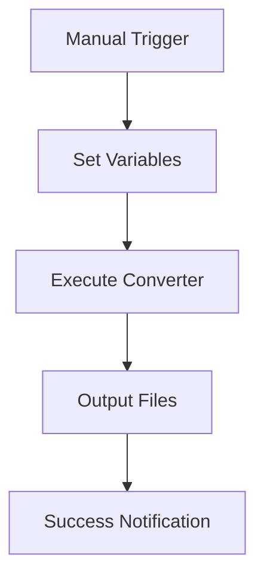
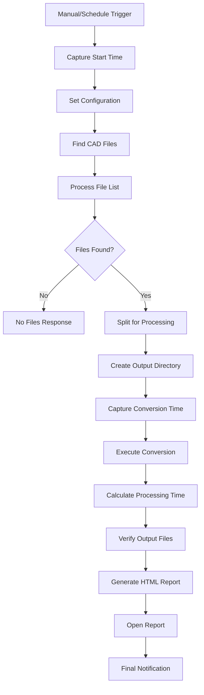
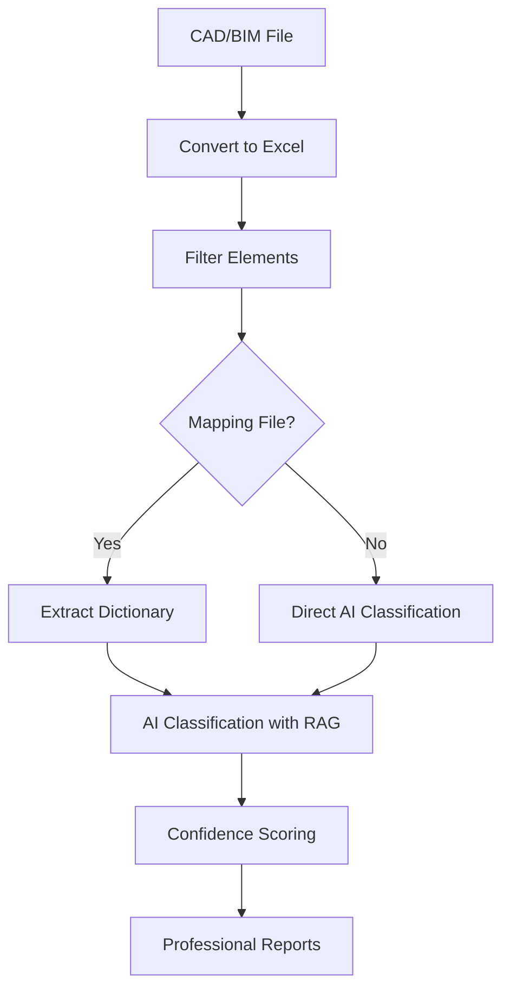

# CAD2Data: Security Analysis & Architecture Documentation

## Executive Summary

This document provides comprehensive security analysis and architecture documentation for the CAD2Data project, which consists of n8n workflows for converting CAD/BIM files (Revit, IFC, DWG, DGN) to structured data formats.

**Risk Level: MEDIUM-HIGH** - The project involves third-party dependencies with known vulnerabilities and processes potentially sensitive CAD/BIM data.

---

# System Architecture Overview

## Architecture Diagram

```
┌─────────────────────────────────────────────────────────────────────┐
│                        CAD2Data System Architecture                  │
├─────────────────────────────────────────────────────────────────────┤
│  User Interface Layer                                               │
│  ┌─────────────────┐  ┌─────────────────┐  ┌─────────────────┐     │
│  │   n8n Web UI    │  │  Browser Forms  │  │   API Clients   │     │
│  └─────────────────┘  └─────────────────┘  └─────────────────┘     │
├─────────────────────────────────────────────────────────────────────┤
│  Workflow Orchestration Layer (n8n)                                │
│  ┌─────────────────┐  ┌─────────────────┐  ┌─────────────────┐     │
│  │  Manual Trigger │  │ Schedule Trigger│  │  Webhook Trigger│     │
│  └─────────────────┘  └─────────────────┘  └─────────────────┘     │
│  ┌─────────────────┐  ┌─────────────────┐  ┌─────────────────┐     │
│  │  File Discovery │  │  Batch Process  │  │   Validation    │     │
│  └─────────────────┘  └─────────────────┘  └─────────────────┘     │
├─────────────────────────────────────────────────────────────────────┤
│  Processing Layer                                                   │
│  ┌─────────────────┐  ┌─────────────────┐  ┌─────────────────┐     │
│  │  CAD Converters │  │ Python Runtime  │  │   AI Services   │     │
│  │  • RvtExporter  │  │  • pandas       │  │  • OpenAI       │     │
│  │  • IfcExporter  │  │  • openpyxl     │  │  • Anthropic    │     │
│  │  • DwgExporter  │  │  • micropip     │  │  • Google       │     │
│  │  • DgnExporter  │  │                 │  │  • xAI          │     │
│  └─────────────────┘  └─────────────────┘  └─────────────────┘     │
├─────────────────────────────────────────────────────────────────────┤
│  Data Layer                                                         │
│  ┌─────────────────┐  ┌─────────────────┐  ┌─────────────────┐     │
│  │   Input Files   │  │  Temp Storage   │  │  Output Files   │     │
│  │  • .rvt files   │  │  • Processing   │  │  • .xlsx files  │     │
│  │  • .ifc files   │  │  • Intermediate │  │  • .dae files   │     │
│  │  • .dwg files   │  │  • Cache        │  │  • .pdf files   │     │
│  │  • .dgn files   │  │                 │  │  • .html reports│     │
│  └─────────────────┘  └─────────────────┘  └─────────────────┘     │
├─────────────────────────────────────────────────────────────────────┤
│  Infrastructure Layer                                               │
│  ┌─────────────────┐  ┌─────────────────┐  ┌─────────────────┐     │
│  │  File System    │  │    Database     │  │    Network      │     │
│  │  • Local Dirs   │  │  • n8n SQLite   │  │  • HTTPS/TLS    │     │
│  │  • Permissions  │  │  • User Data    │  │  • API Calls    │     │
│  │  • Access Ctrl  │  │  • Workflows    │  │  • Webhooks     │     │
│  └─────────────────┘  └─────────────────┘  └─────────────────┘     │
└─────────────────────────────────────────────────────────────────────┘
```

## Core Components

### 1. n8n Workflow Engine

**Technology Stack:**
- Node.js runtime
- Vue.js frontend  
- SQLite/PostgreSQL database
- TypeScript codebase

**Key Features:**
- Visual workflow designer
- Node-based processing engine
- Multiple trigger types (manual, scheduled, webhook)
- Built-in security audit functionality
- External secrets management support

### 2. CAD/BIM Conversion Tools

**Executable Dependencies:**
- `RvtExporter.exe` - Autodesk Revit file processor
- `IfcExporter.exe` - IFC format processor
- `DwgExporter.exe` - AutoCAD DWG processor
- `DgnExporter.exe` - MicroStation DGN processor

**Input/Output Mapping:**
```
Revit (.rvt) → RvtExporter.exe → XLSX + DAE + PDF
IFC (.ifc)   → IfcExporter.exe → XLSX + DAE
DWG (.dwg)   → DwgExporter.exe → XLSX + PDF
DGN (.dgn)   → DgnExporter.exe → XLSX
```

### 3. Python Processing Environment

**Runtime Environment:**
- **Pyodide**: Python runtime in browser/Node.js context
- **micropip**: Package installer for Pyodide environment
- **Security**: Sandboxed execution with module restrictions

**Key Libraries:**
```python
import pandas as pd           # Data manipulation
import openpyxl              # Excel file handling
from io import BytesIO       # Binary data handling
import datetime              # Date/time processing
import base64                # Data encoding/decoding
```

### 4. AI/LLM Integration Services

**Supported Providers:**
- **OpenAI**: GPT-3.5, GPT-4 models for text analysis and classification
- **Anthropic**: Claude 3 models for data analysis and reasoning
- **Google**: Gemini models for multimodal analysis
- **xAI**: Grok models for real-time analysis

---

# Security Analysis

## Third-Party Dependencies Analysis

### Critical Dependencies

#### n8n (v1.0+)
**Security Features:**
- Built-in security audit functionality (`n8n audit`)
- Environment variable access controls
- File system access restrictions
- SSL/TLS support for API communications
- Two-factor authentication support
- External secrets management (HashiCorp Vault, AWS Secrets Manager, Azure Key Vault)

**Security Configuration:**
```bash
# Essential security environment variables
N8N_SECURE_COOKIE=true
N8N_PUBLIC_API_SWAGGERUI_DISABLED=true
N8N_BLOCK_ENV_ACCESS_IN_NODE=true
N8N_RESTRICT_FILE_ACCESS_TO=/safe/directory
N8N_MFA_ENABLED=true
```

#### pandas (Python Data Analysis Library)
**Known Vulnerabilities:**
- **CVE-2023-47248**: Fixed in pandas 2.1.3 - vulnerability in `read_parquet` and `read_feather` functions
- HTML escaping issues in DataFrame formatting
- Potential XML External Entity (XXE) vulnerabilities in file parsing

**Mitigations:**
- Use pandas 2.1.3 or later
- Enable HTML escaping when rendering DataFrames
- Validate input files before processing

#### openpyxl (Excel File Processing)
**Security Considerations:**
- **Potential XXE vulnerability**: Fixed in version 2.4.2
- Worksheet protection uses legacy hashing algorithm
- File corruption issues with certain protection methods

**Security Features:**
- Password protection for workbooks and worksheets
- SHA-based password hashing
- Protection against formula injection

## Vulnerability Assessment

### Critical Issues (Immediate Action Required)

1. **CVE-2023-47248** in pandas versions < 2.1.3
   - **Impact**: Potential arbitrary code execution via malicious Parquet/Feather files
   - **Affected Functions**: `pd.read_parquet()`, `pd.read_feather()`
   - **Fix**: Update to pandas 2.1.3+

### High-Risk Issues

1. **API Key Exposure**
   - **Risk**: Hardcoded API keys in workflow configurations
   - **Impact**: Unauthorized access to AI services, potential data exfiltration
   - **Mitigation**: Use n8n's external secrets management features

2. **File Upload Security**
   - **Risk**: Processing untrusted CAD/BIM files without validation
   - **Impact**: Potential malicious file processing, system compromise
   - **Mitigation**: Implement file type validation and sandboxed processing

3. **Python Code Execution in n8n**
   - **Risk**: Arbitrary Python code execution in workflow nodes
   - **Impact**: System compromise, data exfiltration
   - **Mitigation**: Disable dangerous modules, use restricted execution environments

### Medium-Risk Issues

1. **n8n API Playground Exposure**
   - **Risk**: Swagger UI accessible without authentication
   - **Impact**: API structure disclosure, potential unauthorized access
   - **Mitigation**: Set `N8N_PUBLIC_API_SWAGGERUI_DISABLED=true`

2. **Legacy Password Hashing in openpyxl**
   - **Risk**: Weak password protection for Excel files
   - **Impact**: Password brute-force attacks
   - **Mitigation**: Use additional encryption layers for sensitive files

## Data Flow Security Analysis

### Processing Pipeline Security

```
CAD/BIM Files → n8n Workflows → Conversion Tools → Python Processing → Output Files
     ↓              ↓               ↓                    ↓              ↓
 File Upload    API Calls      Binary Exec       Data Processing   File Export
```

### Security Checkpoints

1. **Input Validation**
   - File type verification
   - File size limits
   - Malware scanning

2. **Processing Security**
   - Sandboxed execution environment
   - Resource usage monitoring
   - Error handling and logging

3. **Output Security**
   - Data sanitization
   - Access control
   - Audit logging

---

# Workflow Architecture

## Workflow Execution Patterns

### 1. Basic Conversion Workflow


### 2. Batch Processing Workflow


### 3. AI-Enhanced Classification Workflow


## Available Workflows

### ⚡️ 1. Basic Conversion Workflows
- **n8n_1_Revit_IFC_DWG_Conversation_simple.json**: Simple conversion with minimal configuration
- **n8n_2_All_Settings_Revit_IFC_DWG_Conversation_simple.json**: Advanced settings with export mode options

### ⚡️ 2. Advanced Processing Workflows  
- **n8n_3_CAD-BIM-Batch-Converter-Pipeline.json**: Batch processing with validation and HTML reporting
- **n8n_4_Validation_CAD_BIM_Revit_IFC_DWG.json**: Data validation against predefined rules

### ⚡️ 3. AI-Enhanced Workflows
- **n8n_5_CAD_BIM_Automatic_Classification_with_LLM_and_RAG.json**: AI-powered element classification
- **n8n_6_Construction_Price_Estimation_with_LLM_for_Revt_and_IFC.json**: Cost estimation using AI
- **n8n_7_Carbon_Footprint_CO2_Estimator_for_Revit_and_IFC.json**: Environmental impact analysis

### ⚡️ 4. Utility Workflows
- **n8n_8_Revit_IFC_DWG_Conversation_EXTRACT_Phase_with_Parse_XLSX.json**: Simple ETL for LLM integration
- **n8n_9_CAD_BIM_Quantity_TakeOff_HTML_Report_Generator.json**: Quantity takeoff reporting

---

# Deployment Security

## Infrastructure Security

### Network Security
- Deploy behind firewall/VPN
- Use HTTPS for all communications
- Implement network segmentation
- Configure proper DNS and SSL certificates

### Access Control
- Enable n8n user management
- Configure single sign-on (SSO)
- Implement role-based access control (RBAC)
- Regular access reviews and audits

### Data Protection
- Encrypt data at rest and in transit
- Regular security backups with encryption
- Data retention and deletion policies
- Compliance with data protection regulations

## Configuration Security

### Essential Security Settings
```bash
# Core security configuration
N8N_SECURE_COOKIE=true
N8N_SAMESITE_COOKIE=strict
N8N_PUBLIC_API_SWAGGERUI_DISABLED=true
N8N_BLOCK_ENV_ACCESS_IN_NODE=true
N8N_RESTRICT_FILE_ACCESS_TO=/safe/directories:/input:/output
N8N_MFA_ENABLED=true
N8N_ENFORCE_SETTINGS_FILE_PERMISSIONS=true
```

### External Secrets Management
```yaml
Supported Providers:
  - HashiCorp Vault
  - AWS Secrets Manager
  - Azure Key Vault
  - Infisical
  - Google Secrets Manager (planned)
```

### Monitoring and Auditing

#### Security Audit Configuration
```bash
# Run comprehensive security audit
n8n audit --categories=["Credentials", "Database", "Filesystem", "Instance", "Nodes"]
```

#### Audit Categories
- **Credentials**: API keys, passwords, tokens
- **Database**: Database security settings
- **Filesystem**: File access permissions and restrictions
- **Instance**: n8n instance configuration
- **Nodes**: Workflow node security

---

# Docker Deployment

## Container Configuration

### Docker Compose Setup
```yaml
version: '3.8'
services:
  n8n:
    image: n8nio/n8n:latest
    ports:
      - "5678:5678"
    environment:
      - N8N_BASIC_AUTH_ACTIVE=true
      - N8N_SECURE_COOKIE=true
      - N8N_PUBLIC_API_SWAGGERUI_DISABLED=true
      - N8N_MFA_ENABLED=true
      - N8N_DATABASE_TYPE=postgresdb
      - N8N_DATABASE_HOST=postgres
    volumes:
      - n8n_data:/home/node/.n8n
      - ./input:/input:ro
      - ./output:/output
      - ./converters:/converters:ro
    depends_on:
      - postgres
      - redis

  postgres:
    image: postgres:15
    environment:
      POSTGRES_DB: n8n
      POSTGRES_USER: n8n
      POSTGRES_PASSWORD: ${DB_PASSWORD}
    volumes:
      - postgres_data:/var/lib/postgresql/data

  redis:
    image: redis:7
    command: redis-server --requirepass ${REDIS_PASSWORD}
    volumes:
      - redis_data:/data

volumes:
  n8n_data:
  postgres_data:
  redis_data:
```

### Security Hardening
```dockerfile
FROM n8nio/n8n:latest

# Create non-root user
USER node

# Set security environment variables
ENV N8N_SECURE_COOKIE=true
ENV N8N_PUBLIC_API_SWAGGERUI_DISABLED=true
ENV N8N_MFA_ENABLED=true
ENV N8N_BLOCK_ENV_ACCESS_IN_NODE=true

# Health check
HEALTHCHECK --interval=30s --timeout=10s --retries=3 \
  CMD curl -f http://localhost:5678/healthz || exit 1
```

---

# Incident Response Plan

## Security Incident Categories

### High Severity
- Unauthorized access to system
- Data exfiltration or breach
- Malware detection
- Service disruption

### Medium Severity
- API key compromise
- Workflow manipulation
- Resource exhaustion attacks
- Configuration drift

### Low Severity
- Failed authentication attempts
- Performance degradation
- Non-critical configuration changes

## Response Procedures

### Immediate Response (0-1 hour)
1. **Isolate**: Disconnect affected systems from network
2. **Assess**: Determine scope and impact
3. **Preserve**: Collect logs and forensic evidence
4. **Notify**: Alert security team and stakeholders

### Investigation (1-24 hours)
1. **Analyze**: Review logs and audit trails
2. **Identify**: Determine attack vectors and impact
3. **Document**: Record findings and timeline
4. **Coordinate**: Work with relevant teams

### Recovery (24-72 hours)
1. **Remediate**: Apply patches and fixes
2. **Restore**: Recover from clean backups if needed
3. **Validate**: Confirm system integrity
4. **Monitor**: Enhanced monitoring post-incident

---

# Compliance and Best Practices

## Data Protection Compliance

### GDPR Requirements
- **Lawful basis**: Establish legal grounds for processing
- **Data minimization**: Process only necessary data
- **Right to erasure**: Implement data deletion capabilities
- **Privacy by design**: Build privacy into system architecture

### Industry Standards
- **ISO 27001**: Information Security Management
- **NIST Cybersecurity Framework**: Comprehensive security controls
- **SOC 2**: Service organization controls
- **Industry-specific**: Comply with relevant sector standards

## Security Best Practices

### Development Security
- Regular dependency updates
- Vulnerability scanning
- Secure coding practices
- Code review processes

### Operational Security
- Regular security assessments
- Incident response testing
- Employee security training
- Vendor risk management

---

# Action Items & Recommendations

## Immediate Actions (0-30 days)

### Critical Vulnerability Remediation
- [ ] **Update pandas to version 2.1.3+** - Addresses CVE-2023-47248
- [ ] **Update openpyxl to version 2.4.2+** - Fixes XXE vulnerability
- [ ] **Enable defusedxml** for safer XML parsing
- [ ] **Disable n8n API playground** in production environments

### Security Configuration
- [ ] **Configure external secrets management** for API keys
- [ ] **Enable two-factor authentication** for all users
- [ ] **Implement file access restrictions** via environment variables
- [ ] **Enable comprehensive audit logging**

## Short-term Actions (30-90 days)

### Security Controls Implementation
- [ ] **Implement file upload validation** and malware scanning
- [ ] **Configure centralized logging** and SIEM integration
- [ ] **Set up security monitoring** and alerting
- [ ] **Create incident response runbooks**

### Documentation and Training
- [ ] **Develop security procedures** and guidelines
- [ ] **Train development team** on secure coding practices
- [ ] **Create user security awareness** materials
- [ ] **Establish security review process**

## Long-term Actions (90-180 days)

### Architecture Enhancement
- [ ] **Implement zero-trust security model**
- [ ] **Deploy security automation tools**
- [ ] **Regular penetration testing** and vulnerability assessments
- [ ] **Establish security governance** framework

### Compliance and Auditing
- [ ] **Conduct compliance gap analysis**
- [ ] **Implement data governance** policies
- [ ] **Regular third-party security reviews**
- [ ] **Establish security metrics** and KPIs

---

# Monitoring and Alerting

## Key Security Metrics

### System Metrics
- Failed authentication attempts
- Privilege escalation events
- Unusual network traffic patterns
- Resource utilization anomalies

### Application Metrics
- Workflow execution failures
- API error rates
- File processing failures
- Security audit findings

### Business Metrics
- Data processing volumes
- User activity levels
- Compliance status
- Security incident frequency

## Alert Configuration

### Critical Alerts (Immediate Response)
- System compromise indicators
- Data exfiltration attempts
- Service outages
- Security policy violations

### Warning Alerts (1-hour Response)
- High error rates
- Performance degradation
- Configuration drift
- Suspicious user behavior

### Info Alerts (Daily Review)
- System updates completed
- Scheduled maintenance
- User management changes
- Routine security events

---

# Conclusion

The CAD2Data project represents a sophisticated workflow automation solution with significant business value but requires careful attention to security considerations. The combination of third-party dependencies, AI service integrations, and sensitive CAD/BIM data processing creates multiple attack vectors that must be properly secured.

## Key Security Priorities

1. **Immediate vulnerability remediation** - Update critical dependencies
2. **Proper secrets management** - Implement external secret stores
3. **Comprehensive monitoring** - Enable audit logging and alerting
4. **Access control** - Implement RBAC and MFA
5. **Regular assessments** - Ongoing security reviews and updates

## Risk Mitigation Success Factors

- **Proactive security posture** with regular vulnerability assessments
- **Defense in depth** approach with multiple security layers
- **Continuous monitoring** and incident response capabilities
- **Regular updates** and security patch management
- **Security awareness** training for all team members

By implementing the recommendations outlined in this document, the CAD2Data project can achieve a robust security posture suitable for production deployment while maintaining its powerful workflow automation capabilities.

---

**Document Version**: 1.0  
**Last Updated**: 2025-08-31  
**Next Review Date**: 2025-11-30  
**Classification**: Internal Use

---

*This document should be reviewed and updated regularly as the project evolves and new security threats emerge. All security recommendations should be implemented in coordination with your organization's security team and policies.*