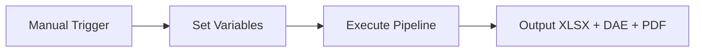
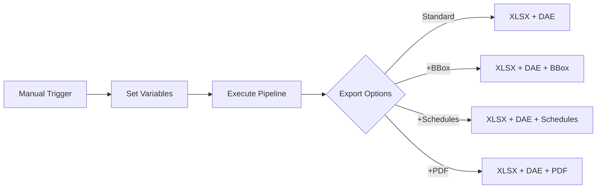
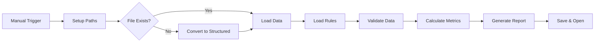
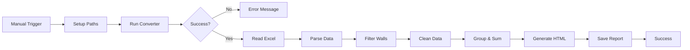

# CAD & BIM Data Pipeline
### Generate Dashboards, Graphs, Documents, Validations, and Quantity Reports in n8n

Convert CAD/BIM files (`.rvt`, `.dwg`, `.ifc`, `.dgn`) to structured Excel data and 3D geometry (DAE) using n8n workflow automation. No Autodesk licenses or APIs required.

[](https://n8n.io)
[](https://github.com/datadrivenconstruction/Revit-IFC-DWG-DGN-Converter-in-n8n-with-QTO/blob/main/LICENSE)
[](https://datadrivenconstruction.io)

<p align="center">
  
</p>

## Tutorial Videos

<table style="border: none; border-collapse: collapse;">
  <tr>
    <td style="border: none; padding-right: 12px; vertical-align: top;">
      <a href="https://youtu.be/HUbEPo-yfeA?si=Gjbj2glKgU3q-XZC" target="_blank">
        
      </a>
    </td>
    <td style="border: none; vertical-align: top;">
     <b> n8n Quick Start: Easy Installation & Pipeline Creation (Templates and LLM) </b>
      <br>
        Step-by-step beginner tutorial on setting up <strong>n8n</strong> from scratch, building your first automation pipeline, and using LLMs (like ChatGPT/Claude) to generate automations.<br>
        <a href="https://youtu.be/HUbEPo-yfeA?si=Gjbj2glKgU3q-XZC" target="_blank">Watch n8n Quick Start on YouTube</a>
      </br>
    </td>
  </tr>
  <tr>
    <td style="border: none; padding-right: 12px; vertical-align: top;">
      <a href="https://www.youtube.com/watch?v=PMTZNRFjD6c" target="_blank">
        
      </a>
    </td>
    <td style="border: none; vertical-align: top;">
     <b> CAD-BIM Data Pipeline Tutorial </b>
      <br>
        Full hands-on walkthrough: automate complex <strong>CAD-BIM data processing</strong> workflows in <code>n8n</code>, including conversion, validation, and actionable analytics.<br>
        <a href="https://www.youtube.com/watch?v=PMTZNRFjD6c" target="_blank">Watch CAD-BIM Pipeline Tutorial on YouTube</a>
      </br>
    </td>
  </tr>
  <tr>
    <td style="border: none; padding-right: 12px; vertical-align: top;">
      <a href="https://www.youtube.com/watch?v=p84AmP2dcvg" target="_blank">
        
      </a>
    </td>
    <td style="border: none; vertical-align: top;">
     <b> ⚡️Automated CAD/BIM Data Validation with n8n | The End of Manual BIM Checks </b>
      <br>
        Discover how to fully automate <strong>CAD/BIM data validation</strong> workflows using the free, open-source <code>n8n</code> platform.Ideal for project teams looking to save hours (or days) every week.<br>
        <a href="https://www.youtube.com/watch?v=p84AmP2dcvg" target="_blank">Watch Automated Validation Tutorial on YouTube</a>
      </br>
    </td>
  </tr>
</table>


## Overview

This pipeline automates the conversion of CAD/BIM files to Excel for quantity takeoffs, data analysis, and further processing. It supports offline operation and extensibility with Python or AI tools.

## Supported Formats

| Format | File Extension | Converter | Output |
|--------|----------------|-----------|--------|
| Revit (2015-2025) | `.rvt` | RvtExporter.exe | XLSX database + DAE geometry + Schedules + PDF Drawings |
| IFC (2x3, 4x1, 4x4, 4x, 4.3) | `.ifc` | IfcExporter.exe | XLSX database + DAE geometry |
| AutoCAD (1983-2025) | `.dwg` | DwgExporter.exe | XLSX database + PDF Drawings |
| MicroStation (v7-v8) | `.dgn` | DgnExporter.exe | XLSX database |

## Key Features

- Automated conversion to Excel (elements as rows, properties as columns).
- Export of 3D polygonal geometry (DAE) with element IDs matching the XLSX data.
- Offline processing without internet, APIs, or licenses.
- Extensible for custom post-processing.

## Quick Start

### Prerequisites

1. **Install Node.js** from [nodejs.org](https://nodejs.org/).
2. **Start n8n** in Command Prompt:
   ```
   npx n8n
   ```
   Access at `http://localhost:5678`.
3. **Download this repository from GitHub**  
   - Click the green "Code" button → "Download ZIP"
   - Unzip the folder
4. **Run the Workflow**
     - You're ready. Just click **Execute Workflow** in n8n to start process your CAD-BIM files
<p align="center">
  
  <br></br>
</p>

# n8n Workflows for working with CAD/BIM data

### ⚡️ 1. Basic Conversion
**File**: `n8n_1_Revit_IFC_DWG_Conversation_simple.json`

Converts CAD/BIM files (`.rvt`, `.ifc`, `.dwg`, `.dgn`) to Excel (XLSX) and Collada (DAE) for Revit/IFC files. Minimal configuration for quick setup.

#### Installation
1. Import `n8n_1_Revit_IFC_DWG_Conversation_simple.json` into n8n via **Workflows > Import from File**.
2. Update **Set Variables** node:
   ```
   # Revit
   path_to_converter: C:\Converters\datadrivenlibs\RvtExporter.exe
   path_project_file: C:\Projects\Model.rvt

   # IFC
   path_to_converter: C:\Converters\datadrivenlibs\IfcExporter.exe
   path_project_file: C:\Projects\Model.ifc

   # DWG
   path_to_converter: C:\Converters\datadrivenlibs\DwgExporter.exe
   path_project_file: C:\Projects\Plan.dwg

   # DGN
   path_to_converter: C:\Converters\datadrivenlibs\DgnExporter.exe
   path_project_file: C:\Projects\Bridge.dgn
   ```
3. Ensure the converter is in the `datadrivenlibs` folder, e.g., `C:\Converters\datadrivenlibs\XxxExporter.exe`.

#### Usage
1. Run the workflow via **Manual Trigger**.
2. Check the output folder for XLSX, DAE, and PDF files.
3. Monitor logs for conversion status.



<p align="center">
  
</p>

### ⚡️ 2. Conversion with Advanced Settings
**File**: `n8n_2_All_Settings_Revit_IFC_DWG_Conversation_simple.json`

Converts CAD/BIM files with customizable export modes (basic: 309 categories, standard: 724 categories, complete: all 1209 categories) and optional outputs like bounding box, Revit schedules, or PDF drawings.

#### Installation
1. Import `n8n_2_All_Settings_Revit_IFC_DWG_Conversation_simple.json` into n8n via **Workflows > Import from File**.
2. Update **Set Variables** node with converter and file paths (same as Basic Conversion).
3. Configure export options:
   ```
   export_mode: basic | standard | complete
   bbox: true | false
   schedule: true | false
   sheets2pdf: true | false
   no-xlsx: true | false
   no-collada: true | false
   ```

#### Usage
1. Run the workflow via **Manual Trigger**.
2. Check the output folder for XLSX, DAE, schedules, or PDF files based on settings.
3. Monitor logs for conversion status.



<p align="center">
  
</p>

### ⚡️ 3. Revit Batch Conversion with Validation and Reporting
**File**: `grok_BP_26072025_14.json`

Automates batch conversion of Revit (`.rvt`) files to Excel (XLSX) and Collada (DAE), validates outputs, tracks processing times, and generates an HTML report with metrics, file links, and configuration details.

#### Installation
1. Import `grok_BP_26072025_14.json` into n8n via **Workflows > Import from File**.
2. Update **Set Configuration Parameters** node:
   ```
   converter_path: C:\Converters\datadrivenlibs\RvtExporter.exe
   source_folder: C:\Sample_Projects
   output_folder: C:\Output
   include_subfolders: true
   file_extension: .rvt
   ```
3. Ensure `RvtExporter.exe` is in `C:\Converters\datadrivenlibs\` and `.rvt` files are in the source folder.

#### Usage
1. Run the workflow via **Manual Trigger**.
2. Monitor logs for file discovery and conversion progress.
3. Review the HTML report (auto-opens in browser) with:
   - Metrics (files processed, success rate, time, sizes).
   - Success/failure tables with file links.
4. Check the output folder for XLSX and DAE files.


### ⚡️ 4. Multi-Format Validation
**Files**: `n8n_3_Validation_CAD_BIM_Revit_IFC_DWG.json`, `DDC_BIM_Requirements_Table_for_Revit_IFC_DWG.xlsx`

Validates CAD/BIM data against predefined rules, generating color-coded Excel reports with data quality metrics.

#### Installation
1. Import `n8n_3_Validation_CAD_BIM_Revit_IFC_DWG.json` into n8n via **Workflows > Import from File**.
2. Update **Setup Paths** node:
   ```
   path_to_converter: C:\Converters\datadrivenlibs\RvtExporter.exe
   project_file: C:\Projects\Model.rvt
   validation_rules_path: C:\Validation\DDC_Revit_IFC_Validation_Table.xlsx
   ```
3. Ensure the converter and validation rules file are accessible.

#### Usage
1. Run the workflow via **Manual Trigger**.
2. Check the output folder for the color-coded XLSX report.
3. Review data quality metrics (fill rates, unique values, patterns).
4. Monitor logs for validation status.



<p align="center">
  
</p>

### ⚡️ 5. Simple ETL for LLM Use Cases
**File**: `n8n_4_Revit_IFC_DWG_Conversation_EXTRACT_Phase_with_Parse_XLSX.json`

Converts a Revit file to Excel, generates an XLSX filename, and parses data for LLM-based automation tasks.

#### Installation
1. Import `n8n_4_Revit_IFC_DWG_Conversation_EXTRACT_Phase_with_Parse_XLSX.json` into n8n via **Workflows > Import from File**.
2. Update **Setup Paths** node:
   ```
   path_to_converter: C:\Converters\datadrivenlibs\RvtExporter.exe
   project_file: C:\Projects\Model.rvt
   ```
3. Ensure the converter is accessible.

#### Usage
1. Run the workflow via **Manual Trigger**.
2. Check the output folder for the XLSX file.
3. Use the parsed data for LLM tasks (e.g., feed JSON to Claude or ChatGPT).
4. Monitor logs for conversion and parsing status.

<p align="center">
  
</p>

### ⚡️ 6. Revit to HTML Quantity Takeoff
**File**: `n8n_5_CAD_BIM_Quantity_TakeOff_HTML_Report_Generatorn.json`

Analyzes Revit wall data, calculates volumes by type, and generates interactive HTML reports with summary statistics.

#### Installation
1. Import `n8n_5_CAD_BIM_Quantity_TakeOff_HTML_Report_Generatorn.json` into n8n via **Workflows > Import from File**.
2. Update **Setup Paths** node:
   ```
   path_to_converter: C:\Converters\datadrivenlibs\RvtExporter.exe
   project_file: C:\Projects\Model.rvt
   ```
3. Ensure the converter is accessible.

#### Usage
1. Run the workflow via **Manual Trigger**.
2. Check the output folder for the HTML report.
3. Review the report (auto-opens in browser) for wall quantities and statistics.
4. Monitor logs for processing status.



<p align="center">
  
</p>

## Troubleshooting

### Module 'os' Blocked Error
In n8n versions 1.98.0–1.101.x, the `os` module is blocked, affecting libraries like pandas. Solution: Use the latest version with `npx n8n@latest`.


## Why DataFrames?

CAD/BIM formats like `.rvt`, `.ifc`, `.dwg`, or `.dgn` are complex and proprietary. Converting them into **DataFrames**—tabular structures with rows (elements) and columns (properties)—enables efficient data processing. Popularized by Python’s pandas library, DataFrames are widely used for their compatibility with automation, analytics, and AI tools. They simplify tasks like filtering, grouping, and visualization, making them ideal for dashboards, quantity takeoffs, and validation.

<p align="center">
  
</p>

**Learn More:**
- [Python Pandas – An Indispensable Tool](https://datadrivenconstruction.io/2025/06/048-python-pandas-an-indispensable-tool-for-working-with-data/)
- [DataFrame – Universal Tabular Data Format](https://datadrivenconstruction.io/2025/06/049-dataframe-universal-tabular-data-format/)
- [Structured Data in Construction](https://datadrivenconstruction.io/2025/06/025-structured-data/)


## 🔄 Re-import Data into Revit

After transforming and enriching your Excel data, you can effortlessly push the modified data back into your Revit project. Our dedicated tool **[ImportExcelToRevit](https://github.com/datadrivenconstruction/ImportExcelToRevit)** makes this process seamless by directly importing updated Excel sheets into Revit parameters and families.

> **Simplify your BIM workflow:** Revit ➡️ Excel ➡️ Transform ➡️ Excel ➡️ Revit.
https://github.com/datadrivenconstruction/ImportExcelToRevit


## Next Level Automation

For AI-powered processing and advanced automation:

🤖 **[CAD-(BIM)-to-Code Automation Pipeline with LLM (ChatGPT)](https://github.com/datadrivenconstruction/CAD-BIM-to-Code-Automation-Pipeline-DDC-Workflow-with-LLM-ChatGPT)**

Features ChatGPT integration, element classification, and code generation.


## Contributing

We welcome contributions! Please feel free to:
- Report bugs
- Suggest features
- Submit pull requests
- Improve documentation


## Support

- 🌐 **Website**: [DataDrivenConstruction.io](https://datadrivenconstruction.io)
- 💬 **Issues**: [GitHub Issues](https://github.com/datadrivenconstruction/Revit-IFC-DWG-DGN-Converter-in-n8n-with-QTO/issues)
- 📧 **Email**: info@datadrivenconstruction.io
  

## Consulting & Industry Training

We work with leading construction, engineering, major consulting agencies and technology firms around the world to help them implement open data principles, automate CAD/BIM processing and build robust ETL pipelines.

Our team provides hands-on workshops, strategic advice and prototyping with real-world project workflows in mind.

Over the last few years we have actively supported organisations seeking practical solutions for digital transformation and interoperability. Many have enquired about solving data quality problems - wanting to implement the open and automated methods we advocate. Today, these approaches are used in all planning, design and construction workflows around the world.

For inquiries or workshop bookings, visit [DataDrivenConstruction.io](https://datadrivenconstruction.io).


---

<p align="left">
 
  <a href="https://datadrivenconstruction.io">
    
  </a>
  <br>
   <b>   Unlock the Power of Data in Construction</b>
   <br>
     🚀 Move to full-cycle data management  where only unified granular  <br /> structured data & processes remain and where  🔓 your data is yours
</p>

