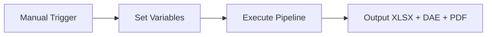
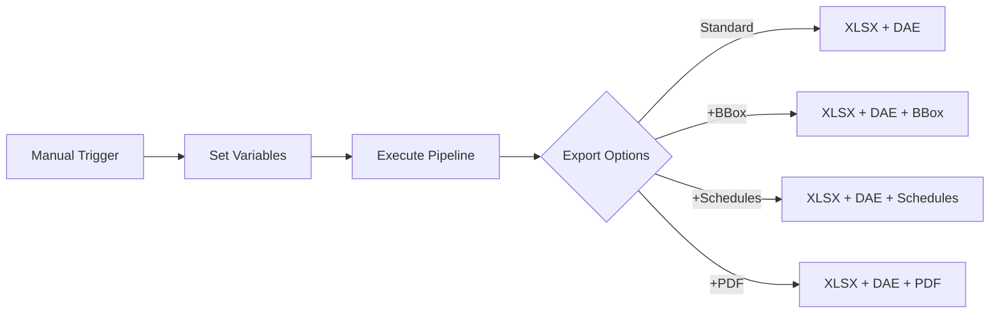
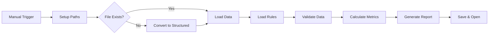
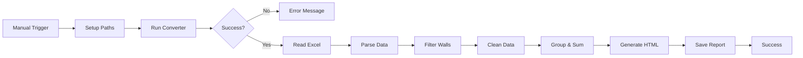

# CAD & BIM Data Pipeline: Generate Dashboards, Graphs, Documents, Validations, and Quantity Reports in n8n

Convert CAD/BIM files (`.rvt`, `.dwg`, `.ifc`, `.dgn`) to structured Excel data and 3D geometry (DAE) using n8n workflow automation. No Autodesk licenses or APIs required.

[](https://n8n.io)
[](https://github.com/datadrivenconstruction/Revit-IFC-DWG-DGN-Converter-in-n8n-with-QTO/blob/main/LICENSE)
[](https://datadrivenconstruction.io)

<p align="center">
  
</p>

## Overview

This pipeline automates conversion of CAD/BIM files to Excel for quantity takeoffs, data analysis, and further processing. It supports offline operation and extensibility with Python or AI tools.

### Tutorial Videos

| Video | Description |
|-------|-------------|
| [n8n Quick Start](https://youtu.be/HUbEPo-yfeA?si=Gjbj2glKgU3q-XZC) | Step-by-step guide to installing n8n, building pipelines, and using LLMs for automation. |
| [CAD-BIM Data Pipeline](https://www.youtube.com/watch?v=PMTZNRFjD6c) | Walkthrough of CAD/BIM data processing, conversion, validation, and analytics in n8n. |
| [Automated CAD/BIM Validation](https://www.youtube.com/watch?v=p84AmP2dcvg) | Guide to automating validation workflows for compliance with EIR, BIM Execution Plans, and IDS. |

## Supported Formats

| Format | File Extension | Converter | Output |
|--------|----------------|-----------|--------|
| Revit (2015-2025) | `.rvt` | RvtExporter.exe | XLSX database + DAE geometry + Schedules + PDF Drawings |
| IFC (2x3, 4x1, 4x4, 4x, 4.3) | `.ifc` | IfcExporter.exe | XLSX database + DAE geometry |
| AutoCAD (1983-2025) | `.dwg` | DwgExporter.exe | XLSX database + PDF Drawings |
| MicroStation (v7-v8) | `.dgn` | DgnExporter.exe | XLSX database |

## Key Features

- Automated conversion to Excel (elements as rows, properties as columns).
- Export of 3D polygonal geometry (DAE) with element IDs matching the XLSX data.
- Offline processing without internet, APIs, or licenses.
- Extensible for custom post-processing.

## Quick Start

### Prerequisites

1. Install Node.js from [nodejs.org](https://nodejs.org/).
2. Start n8n in Command Prompt:
   ```
   npx n8n
   ```
   Access at `http://localhost:5678`.
3. Download this repository from [GitHub](https://github.com/datadrivenconstruction/Revit-IFC-DWG-DGN-Converter-in-n8n-with-QTO) as ZIP and unzip.
4. Import workflow:
   - In n8n, select **Import from File**.
   - Choose the `.json` file.
   - Update file paths in **Set** nodes.
5. Execute the workflow.

<p align="center">
  
</p>

## Available Workflows

### 1. Basic Conversion
**File**: `n8n_1_Revit_IFC_DWG_Conversation_simple.json`

Converts files to XLSX and DAE (for Revit/IFC).



Example variables:
```
# Revit
path_to_converter: C:\Converters\datadrivenlibs\RvtExporter.exe
path_project_file: C:\Projects\Model.rvt

# IFC
path_to_converter: C:\Converters\datadrivenlibs\IfcExporter.exe
path_project_file: C:\Projects\Model.ifc

# DWG
path_to_converter: C:\Converters\datadrivenlibs\DwgExporter.exe
path_project_file: C:\Projects\Plan.dwg

# DGN
path_to_converter: C:\Converters\datadrivenlibs\DgnExporter.exe
path_project_file: C:\Projects\Bridge.dgn
```

**Converter Path Note**: Use the executable inside `datadrivenlibs` folder, e.g., `DDC_Exporter_XXXXXXX\datadrivenlibs\XxxExporter.exe`.

<p align="center">
  
</p>

### 2. Conversion with Advanced Settings
**File**: `n8n_2_All_Settings_Revit_IFC_DWG_Conversation_simple.json`

Supports custom modes: basic (309 categories), standard (724 categories), complete (all 1209 categories). Options: bounding box, Revit schedules, PDF export.



<p align="center">
  
</p>

### 3. Multi-Format Validation Pipeline
**Files**: `n8n_3_Validation_CAD_BIM_Revit_IFC_DWG.json`, `DDC_BIM_Requirements_Table_for_Revit_IFC_DWG.xlsx`

Validates data against rules, generates color-coded XLSX reports with metrics.

Configuration:
```
path_to_converter: "C:\\Converters\\RvtExporter.exe"
project_file: "C:\\Projects\\Model.rvt"
validation_rules_path: "C:\\Validation\\DDC_Revit_IFC_Validation_Table.xlsx"
```



<p align="center">
  
</p>

### 4. Simple ETL Pipeline for LLM Use Cases
**File**: `n8n_4_Revit_IFC_DWG_Conversation_EXTRACT_Phase_with_Parse_XLSX.json`

Converts Revit file, generates XLSX filename, parses data. Import JSON into n8n and customize.

<p align="center">
  
</p>

### 5. Revit to HTML Quantity Takeoff Generator
**File**: `n8n_5_CAD_BIM_Quantity_TakeOff_HTML_Report_Generatorn.json`

Analyzes walls, calculates volumes by type, generates interactive HTML reports.



<p align="center">
  
</p>

## Troubleshooting

### Module 'os' Blocked Error
In n8n versions 1.98.0–1.101.x, the `os` module is blocked, affecting libraries like pandas. Solution: Use the latest version with `npx n8n@latest`.

## Re-import Data into Revit

Use [ImportExcelToRevit](https://github.com/datadrivenconstruction/ImportExcelToRevit) to import modified XLSX back into Revit.

## Next Level Automation

For AI integration: [CAD-(BIM)-to-Code Automation Pipeline with LLM](https://github.com/datadrivenconstruction/CAD-BIM-to-Code-Automation-Pipeline-DDC-Workflow-with-LLM-ChatGPT).

## Contributing

Report bugs, suggest features, or submit pull requests via [GitHub](https://github.com/datadrivenconstruction/Revit-IFC-DWG-DGN-Converter-in-n8n-with-QTO).

## Support

- Website: [DataDrivenConstruction.io](https://datadrivenconstruction.io)
- Issues: [GitHub Issues](https://github.com/datadrivenconstruction/Revit-IFC-DWG-DGN-Converter-in-n8n-with-QTO/issues)
- Email: [info@datadrivenconstruction.io](mailto:info@datadrivenconstruction.io)

## Consulting & Training

Contact us for workshops on data management, automation, and ETL pipelines in construction. Visit [DataDrivenConstruction.io](https://datadrivenconstruction.io).

## Why DataFrames?

CAD/BIM formats like `.rvt`, `.ifc`, `.dwg`, or `.dgn` are complex and proprietary. Converting them into **DataFrames**—tabular structures with rows (elements) and columns (properties)—enables efficient data processing. Popularized by Python’s pandas library, DataFrames are widely used for their compatibility with automation, analytics, and AI tools. They simplify tasks like filtering, grouping, and visualization, making them ideal for dashboards, quantity takeoffs, and validation.

<p align="center">
  
</p>

**Learn More:**
- [Python Pandas – An Indispensable Tool](https://datadrivenconstruction.io/2025/06/048-python-pandas-an-indispensable-tool-for-working-with-data/)
- [DataFrame – Universal Tabular Data Format](https://datadrivenconstruction.io/2025/06/049-dataframe-universal-tabular-data-format/)
- [Structured Data in Construction](https://datadrivenconstruction.io/2025/06/025-structured-data/)