# 🏗️ CAD/BIM Converter to Excel + Geometry (+BBOX, +Schedules, +PDF Drawings) + Pipeline QTO Takeoff 

<p align="center">
  
</p>

**Convert your CAD/BIM files to structured data and 3D geometry without Autodesk® licences or APIs, for free and in open tools**
[](https://n8n.io)
[](LICENSE)
[](https://datadrivenconstruction.io)

## Overview

This automated pipeline converts CAD/BIM (`.rvt`, `.dwg`, `.ifc`, `.dgn`) files into structured Excel data and 3D geometry (DAE) using n8n workflow automation. Perfect for quantity takeoffs, data analysis, and downstream processing without requiring expensive licenses.

## Supported Formats

| Format | File Extension | Converter | Output |
|--------|----------------|-----------|--------|
| **Revit** | `.rvt` | RvtExporter.exe | Excel + DAE geometry |
| **IFC** | `.ifc` | IfcExporter.exe | Excel + DAE geometry |
| **AutoCAD** | `.dwg` | DwgExporter.exe | Excel data |
| **MicroStation** | `.dgn` | DgnExporter.exe | Excel data |

## Key Features

- 🔄 **Automated Conversion**: One-click conversion from CAD/BIM to Excel
- 📊 **Structured Data**: All elements and properties exported as Excel matrix DataFrame - project elements with native ID in the rows, all properties of all elements in the columns
- 🧱 **3D Geometry**: Polygonal geometry export for Revit/IFC (DAE format) with the native ID, which is also in DataFrame XLSX. In this way you get full project meta-information with geometry of each element
- 🖥️ **Offline Processing**: No internet, APIs, plugins or Autodesk® licenses required
- 📈 **Quantity Takeoffs**: Built-in QTO report generation for walls
- 🔧 **Extensible**: Easy to customize with Python or AI post-processing

## Quick Start

### Prerequisites
- [Node.js](https://nodejs.org/) installed
- [n8n](https://n8n.io/download) workflow platform
- DDC Converters ([Download](https://cadbimconverter.com/convertors/))

### Installation

1. **Install n8n**
   ```bash
   npx n8n
   ```

2. **Download Converters**
   - Place converter executables in a dedicated folder (e.g., `C:\Converters\`)

3. **Import Workflow**
   - Download workflow JSON from this repository
   - In n8n: **Import from file** → Select JSON
   - Configure file paths in the **Set** node

### Configuration Example

```javascript
// Basic conversion setup
path_to_converter: "C:\\Converters\\RvtExporter.exe"
source_file: "C:\\Projects\\Sample.rvt"
```


# ⚡️ Available Workflows

## 1. Basic Conversion
**File**: `n8n_Revit_IFC_DWG_Conversation_simple.json`

```mermaid
graph TD;
    A[🟢 Manual Trigger] --> B[🛠 Set Basic Variables]
    B --> C[🧰 Execute Converter]
    C --> D[📂 Output XLSX + DAE]
```

- Simple file conversion to Excel + geometry (for Revit and IFC)
- Minimal configuration required


📂 Example Variables
```# Revit
path_to_converter: C:\Converters\RvtExporter.exe
source_file:       C:\Projects\Model.rvt

# IFC
path_to_converter: C:\Converters\IfcExporter.exe
source_file:       C:\Projects\Model.ifc

# DWG
path_to_converter: C:\Converters\DwgExporter.exe
source_file:       C:\Projects\Plan.dwg

# DGN
path_to_converter: C:\Converters\DgnExporter.exe
source_file:       C:\Projects\Bridge.dgn
```


<p align="center">
  
</p>

## 2. CAD-BIM data conversion with advanced settings (+BBOX, +Schedules, +PDF Drawings)
**File**: `n8n_All_Settings_Revit_IFC_DWG_Conversation_simple.json`

- Full control over export parameters
- Custom export modes: `basic`, `standard`, `complete`
- Optional features: +BoundingBox, +Revit Schedules, +PDF export for Drawings

#### Export Modes
- **Basic**: Essential geometry and properties
- **Standard**: Includes materials and parameters
- **Complete**: Full model data with relationships

#### Optional Outputs
- `bbox`: Include bounding box geometry
- `schedule`: Export Revit schedules
- `sheets2pdf`: Convert sheets to PDF
- `-no-xlsx`: Skip Excel export
- `-no-collada`: Skip geometry export

```mermaid
graph TD;
    A[🟢 Manual Trigger] --> B[🛠 Set Advanced Variables]
    B --> C[⚙️ Configure Export Mode]
    C --> D[🧰 Execute Pipeline]
    D --> E{Export Options}
    E -->|Standard| F[📊 XLSX + DAE]
    E -->|+BBox of Elements| G[📊 XLSX + DAE + BBox]
    E -->|+Revit Schedules in Excel| H[📊 XLSX + DAE + Schedules]
    E -->|+Drawings PDF| I[📊 XLSX + DAE + PDF]
```
  


<p align="center">
  
</p>


### 3. ETL - Revit to HTML Quantity Takeoff Generator
**File**: `n8n_CAD_BIM_Quantity_TakeOff_HTML_Report_Generatorn.json`

```mermaid
graph TD;
    A[🟢 Manual Trigger] --> B[🛠 Setup File Paths]
    B --> C[🔄 Run Revit Converter]
    C --> D{Conversion Success?}
    D -->|❌ Error| E[Show Error Message]
    D -->|✅ Success| F[📖 Read Excel File]
    F --> G[🔍 Parse to JSON]
    G --> H[🏗️ Filter OST_Walls]
    H --> I[🧹 Clean Wall Data]
    I --> J[📊 Group by Type & Sum Volume]
    J --> K[🎨 Generate HTML Report]
    K --> L[💾 Save Report File]
    L --> M[✅ Success Summary]
```

- Automated wall quantity analysis
- Professional HTML reports
- Volume calculations by wall type

**Generated Reports Include:**
- 📊 Summary statistics (total elements, volumes, averages)
- 📋 Detailed breakdown by element type - "Type Name"
- 🎨 Interactive HTML dashboard




<p align="center">
  
</p>


## Next Level Automation

For AI-powered processing and advanced automation:

🤖 **[Full LLM Pipeline](https://github.com/datadrivenconstruction/CAD-BIM-to-Code-Automation-Pipeline-DDC-Workflow-with-LLM-ChatGPT)**

Features ChatGPT integration, element classification, and code generation.


## Contributing

We welcome contributions! Please feel free to:
- Report bugs
- Suggest features
- Submit pull requests
- Improve documentation


## Support

- 🌐 **Website**: [DataDrivenConstruction.io](https://datadrivenconstruction.io)
- 💬 **Issues**: [GitHub Issues](https://github.com/datadrivenconstruction/Revit-IFC-DWG-DGN-Converter-in-n8n-with-QTO/issues)
- 📧 **Email**: info@datadrivenconstruction.io
  

## Consulting & Industry Training

We work with leading construction, engineering, major consulting agencies and technology firms around the world to help them implement open data principles, automate CAD/BIM processing and build robust ETL pipelines.

Our team provides hands-on workshops, strategic advice and prototyping with real-world project workflows in mind.

Over the last few years we have actively supported organisations seeking practical solutions for digital transformation and interoperability. Many have enquired about solving data quality problems - wanting to implement the open and automated methods we advocate. Today, these approaches are used in all planning, design and construction workflows around the world.

For inquiries or workshop bookings, visit [DataDrivenConstruction.io](https://datadrivenconstruction.io).


---

<p align="left">
 
  <a href="https://datadrivenconstruction.io">
    
  </a>
  <br>
   <b>   Unlock the Power of Data in Construction</b>
   <br>
     🚀 Move to full-cycle data management  where only unified granular  <br /> structured data & processes remain and where  🔓 your data is yours
</p>
