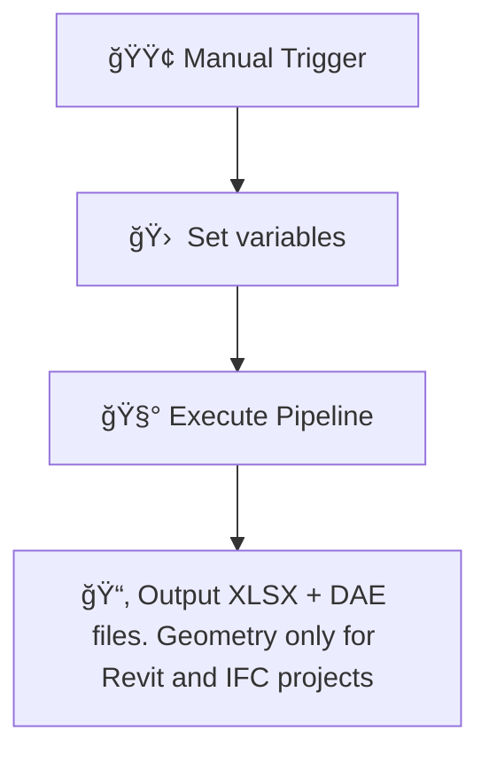

<p align="center">
  
</p>

# 🔁 Revit (.rvt), AutoCAD (.dwg), IFC and MicroStation (.dgn) to Excel + Geometry Converter (n8n Minimal Pipeline) + QT

**Revit (.rvt), AutoCAD (.dwg), IFC, MicroStation (.dgn)  → Excel + DAE (for .rvt, .ifc) — no Autodesk® tools or APIs**

> ✅ Lightweight & local workflow powered by [n8n](https://n8n.io) + [DataDrivenConstruction Converters](https://cadbimconverter.com)

---

## 🛠 Features

Supports the following formats:
- Revit (`.rvt`)
- IFC (`.ifc`)
- AutoCAD (`.dwg`)
- MicroStation (`.dgn`)

- 🧾 Exports full metadata to `.xlsx` (as a matrix - project elements in the rows, all properties of all elements in the columns)
- 🧱 Exports polygonal geometry from Revit and IFC into an open geometric format `.dae` (Collada) 
- 🖥️ Works offline — no Autodesk® license, no API, no plugins needed
- 🧩 Easily extendable with Python or AI post-processing 
(see Pipeline with LLM [CAD-BIM-to-Code-Automation-Pipeline-DDC-Workflow-with-LLM-ChatGPT]([https://n8n.io](https://github.com/datadrivenconstruction/CAD-BIM-to-Code-Automation-Pipeline-DDC-Workflow-with-LLM))


---

## 📦 Installation Guide

### 1. Install `n8n` on Windows

Make sure you have **Node.js** installed ([Download](https://nodejs.org/en/download)):

```bash & cmd
npx install -g n8n
n8n start
```
or
``` bash & cmd
npx n8n
```

Or use the desktop version from: [n8n.io/download](https://n8n.io/download)

---

### 2. Download Converters

Either use the converters that are in the repository or download the always fresh ones directly from the site

| Format                | Converter         | Download |
|-----------------------|-------------------|----------|
| Revit (.rvt)          | `RvtExporter.exe` | [Download](https://cadbimconverter.com/convertors/) |
| IFC                   | `IfcExporter.exe` | [Download](https://cadbimconverter.com/convertors/) |
| AutoCAD (.dwg)        | `DwgExporter.exe` | [Download](https://cadbimconverter.com/convertors/) |
| MicroStation (.dgn)   | `DgnExporter.exe` | [Download](https://cadbimconverter.com/convertors/) |


---

## ⚙️ Quick Setup

1. [⬇ Download workflow JSON](./n8n_Revit_IFC_DWG_Conversation_simple.json)

2. Open **n8n**, click **Import from file**, and select the JSON above.

3. Edit variables in the **Set** node based on the format:
Example for Revit:
- `path_to_converter`: `C:\Converters\RvtExporter.exe`
- `source_file`: `C:\Projects\Model.rvt`

---

**Conversion of CAD (BIM) data into structured formats**
```
n8n_Revit_IFC_DWG_Conversation_simple.json
n8n_All_Settings_Revit_IFC_DWG_Conversation_simple.json
n8n_Revit_IFC_DWG_Conversation_simple_with_comments.json
```


## 🔁 Workflow Overview


---

## 📂 Example Variables

```text
# Revit
path_to_converter: C:\Converters\RvtExporter.exe
source_file:       C:\Projects\Model.rvt

# IFC
path_to_converter: C:\Converters\IfcExporter.exe
source_file:       C:\Projects\Model.ifc

# DWG
path_to_converter: C:\Converters\DwgExporter.exe
source_file:       C:\Projects\Plan.dwg

# DGN
path_to_converter: C:\Converters\DgnExporter.exe
source_file:       C:\Projects\Bridge.dgn
```
<p align="center">
  
</p>

# Revit Wall Quantity Takeoff Generator


<p align="center">
  
</p>

# 📊 Revit Wall Quantity Takeoff → HTML Report (ETL Workflow)

This **n8n automated pipeline** extracts wall data from Revit `.rvt` files and generates a professional, interactive **HTML quantity takeoff report** — entirely offline.

> ✅ No Autodesk® Revit® API required  
> ✅ Converts `.rvt` to `.xlsx` and generates a visual summary  
> ✅ Based on ETL best practices (Extract → Transform → Load)

---

## 🔁 ETL Overview

| Phase      | Tasks |
|------------|-------|
| 🔷 **Extract**   | Convert Revit → Excel, parse spreadsheet |
| 🔷 **Transform** | Filter `OST_Walls`, clean and group data, compute volume metrics |
| 🔷 **Load**      | Generate HTML dashboard with CSS styling and save it locally |

---

## 📊 Workflow Diagram (ASCII)

```text
Start
  │
  ▼
Setup - Define file paths
  │
  ▼
Run Revit Converter (.exe)
  │
  ├──▶ ❌ If error → Show error message
  │
  ▼
Create Excel filename
  │
  ▼
Read Excel file
  │
  ▼
Parse Excel → JSON
  │
  ▼
Filter by Category = "OST_Walls"
  │
  ▼
Clean wall data (extract Type & Volume)
  │
  ▼
Group by Type Name & sum Volumes
  │
  ▼
Generate styled HTML report
  │
  ▼
Save report as .html file
  │
  ▼
✅ Final success output (summary & file path)


## 🎯 Purpose
Converts Revit (.rvt) files into comprehensive wall analysis reports with volume calculations, grouped by wall types.

## 📋 What it does
1. **Extract** - Runs Revit converter to export data to Excel
2. **Transform** - Filters wall elements, cleans data, and groups by type
3. **Load** - Generates beautiful HTML dashboard with summary statistics

## 📊 Output
- Interactive HTML report with:
  - Summary cards (total types, walls, volume, averages)
  - Detailed breakdown by wall type
  - Visual progress bars and metrics
  - Professional styling and responsive design

## 🔧 Requirements
- n8n workflow automation platform
- DDC Revit Converter (RvtExporter.exe)
- Revit files (.rvt format)

## 📁 File Structure
```
Input:  [project_name].rvt
Output: [project_name]_quantity_takeoff_report.html
```

## 🚀 Usage
1. Set file paths in "Setup" node
2. Run workflow manually
3. Open generated HTML report in browser

<p align="center">
  
</p>


## 🧰 Advanced Revit Conversion Pipeline

For advanced users who want **full control over export settings**, use the extended pipeline:

👉 [All_Settings_Revit_Conversation_with_n8n_simple.json](./n8n_All_Settings_Revit_IFC_DWG_Conversation_simple.json)

This version includes detailed options inside the **Set** node:
- `Export mode`: choose between `basic`, `standard`, or `complete`
- Add BoundingBox geometry with `bbox`
- Export Revit schedules with `schedule`
- Export all sheets to PDF with `sheets2pdf`
- Disable `.xlsx` or `.dae` output with `-no-xlsx` or `-no-collada`

🔧 This pipeline gives you full flexibility to tailor exports to your needs.


---


## 🤖 Looking for More Automation?

If you need **more advanced processing**, such as:

- 🔍 Attribute filtering and classification  
- 🧠 AI-powered decision-making (e.g. Excel + ChatGPT logic)  
- 📚 Custom rules and automation for specific element types  
- 🛠️ Integration with other project data sources  

Check out the full-featured LLM-powered pipeline:

👉 [**CAD-BIM-to-Code-Automation-Pipeline-DDC-Workflow-with-LLM-ChatGPT**](https://github.com/datadrivenconstruction/CAD-BIM-to-Code-Automation-Pipeline-DDC-Workflow-with-LLM-ChatGPT)

This version includes prebuilt AI post-processing nodes, classification logic, and examples for automating **element matching**, **naming cleanup**, and **code generation** for construction projects.

No Autodesk® API or cloud dependency — just Python, n8n and local tools 🖥️.


---

## 🧠 Powered by

- [`n8n`](https://n8n.io)
- [`DataDrivenConstruction.io`](https://datadrivenconstruction.io)
- Offline `.exe` converter (no Autodesk® tools)

<p align="center">
  
</p>
