<p align="center">
  
</p>

# 🔁 Revit (.rvt), AutoCAD (.dwg), IFC and MicroStation (.dgn) to Excel + Geometry Converter (n8n Minimal Pipeline)

**Revit (.rvt), AutoCAD (.dwg), IFC, MicroStation (.dgn)  → Excel + DAE (for .rvt, .ifc) — no Autodesk® tools or APIs**

> ✅ Lightweight & local workflow powered by [n8n](https://n8n.io) + [DataDrivenConstruction Converters](https://cadbimconverter.com)

---

## 🛠 Features

Supports the following formats:
- Revit (`.rvt`)
- IFC (`.ifc`)
- AutoCAD (`.dwg`)
- MicroStation (`.dgn`)

- 🧾 Exports full metadata to `.xlsx`
- 🧱 Exports polygonal geometry from Revit and IFC to `.dae` (Collada) 
- 🖥️ Works offline — no Autodesk® license or API needed
- 🧩 Easily extendable with Python or AI post-processing

---

## 📦 Installation Guide

### 1. Install `n8n` on Windows

Make sure you have **Node.js** installed ([Download](https://nodejs.org/en/download)):

```bash (cmd)
npx install -g n8n
n8n start
```

Or use the desktop version from: [n8n.io/download](https://n8n.io/download)

---

### 2. Download Converters

| Format     | Converter         | Download |
|------------|-------------------|----------|
| Revit      | `RvtExporter.exe` | [Download](https://cadbimconverter.com/convertors/) |
| IFC        | `IfcExporter.exe` | [Download](https://cadbimconverter.com/convertors/) |
| AutoCAD DWG| `DwgExporter.exe` | [Download](https://cadbimconverter.com/convertors/) |
| DGN        | `DgnExporter.exe` | [Download](https://cadbimconverter.com/convertors/) |


---

## ⚙️ Quick Setup

1. [⬇ Download workflow JSON](./Revit_Conversation_with_n8n_simple_with_comments.json)

2. Open **n8n**, click **Import from file**, and select the JSON above.

3. Edit variables in the **Set** node based on the format:
Example for Revit:
- `path_to_converter`: `C:\Converters\RvtExporter.exe`
- `source_file`: `C:\Projects\Model.rvt`

---

## 🔁 Workflow Overview

```mermaid
graph TD;
    A[🟢 Manual Trigger] --> B[🛠 Set Paths]
    B --> C[🧰 Execute Revit Converter]
    C --> D[📂 Output XLSX + DAE files]
```



---

## 📂 Example Variables

```text
# Revit
path_to_converter: C:\Converters\RvtExporter.exe
source_file:       C:\Projects\Model.rvt

# IFC
path_to_converter: C:\Converters\IfcExporter.exe
source_file:       C:\Projects\Model.ifc

# DWG
path_to_converter: C:\Converters\DwgExporter.exe
source_file:       C:\Projects\Plan.dwg

# DGN
path_to_converter: C:\Converters\DgnExporter.exe
source_file:       C:\Projects\Bridge.dgn
```

---

## 📄 Output

- `MyModel.xlsx` — full metadata (element IDs, parameters, categories)
- `MyModel.dae` — polygonal geometry for viewing or reuse

---

## 🧠 Powered by

- [`n8n`](https://n8n.io)
- [`DataDrivenConstruction.io`](https://datadrivenconstruction.io)
- Offline `.exe` converter (no Autodesk® tools)

---

<p align="center">
  
</p>
