<p align="center">
  
</p>

# 🏗️ CAD & BIM Data Pipeline: Generate Dashboards, Validations, and Quantity Reports in n8n (with ChatGPT and other LLMs)

**Convert your CAD/BIM files to structured data and 3D geometry without Autodesk® licences or APIs, for free and in open tools**
[](https://n8n.io)
[](LICENSE)
[](https://datadrivenconstruction.io)

## Overview

This automated pipeline converts CAD/BIM (`.rvt`, `.dwg`, `.ifc`, `.dgn`) files into structured Excel data and 3D geometry (DAE) using n8n workflow automation. Perfect for quantity takeoffs, data analysis, and downstream processing without requiring expensive licenses.

<table style="border: none; border-collapse: collapse;">
  <tr>
    <td style="border: none; padding-right: 12px; vertical-align: top;">
      <a href="https://www.youtube.com/watch?v=PMTZNRFjD6c" target="_blank">
        
      </a>
    </td>
    <td style="border: none; vertical-align: top;">
     <h4> 📺 Video Tutorial </h4>
      <p>
        Watch the full tutorial on how to use this repository to automate data processing from <strong>CAD formats</strong> using <code>n8n</code>. Transform your <code>construction data chaos into organized, actionable insighst</code> — without writing a single line of code:  👉 <a href="https://www.youtube.com/watch?v=PMTZNRFjD6c" target="_blank">Watch on YouTube</a>
      </p>
    </td>
  </tr>
</table>


## Supported Formats

| Format | File Extension | Converter | Output |
|--------|----------------|-----------|--------|
| **Revit (2015-2025)** | `.rvt` | RvtExporter.exe | Excel + DAE geometry |
| **IFC2x3, IFC4x1, IFC4x4, IFC4x, IFC4.3** | `.ifc` | IfcExporter.exe | Excel + DAE geometry |
| **AutoCAD 1983-2025** | `.dwg` | DwgExporter.exe | Excel data |
| **MicroStation v7-v8** | `.dgn` | DgnExporter.exe | Excel data |

## Key Features

-  **Automated Conversion**: One-click conversion from CAD/BIM to Excel
-  **Structured Data**: All elements and properties exported as Excel matrix DataFrame - project elements with native ID in the rows, all properties of all elements in the columns
-  **3D Geometry**: Polygonal geometry export for Revit/IFC (DAE format) with the native ID, which is also in DataFrame XLSX. In this way you get full project meta-information with geometry of each element
-  **Offline Processing**: No internet, APIs, plugins or Autodesk® licenses required
-  **Quantity Takeoffs**: Built-in QTO report generation for walls
-  **Extensible**: Easy to customize with Python or AI post-processing

## Quick Start

### ✅ Prerequisites. What You Need

1. **Install Node.js**  
   Download from [nodejs.org](https://nodejs.org/) and install it.

2. **Start n8n**  
   Open Command Prompt and run:
   ```bash
   npx n8n
   ```
   This will automatically download and open n8n in your browser.

3. **Download this repository from GitHub**  
   - Click the green “Code” button → “Download ZIP”
   - Unzip the folder

4. **Import the workflow into n8n**
   - Open n8n in your browser (`http://localhost:5678`)
   - Click **Import from File**
   - Select the `.json` file from the repo
   - Update file paths in the **Set** nodes
     
5. **▶️ Run the Workflow**
     - You're ready!  
     Just click **Execute Workflow** in n8n to start process your CAD-BIM files
   
<p align="center">
  
</p>


📺 Video Tutorial: 👉 <a href="https://www.youtube.com/watch?v=PMTZNRFjD6c" target="_blank">Watch on YouTube</a>


# Available Workflows

## ⚡️  1. Basic Conversion
**File**: `n8n_1_Revit_IFC_DWG_Conversation_simple.json`

- Simple file conversion to Excel + geometry (for Revit and IFC)
- Minimal configuration required

```mermaid
graph TD;
    A[🟢 Manual Trigger] --> B[🛠 Set Basic Variables]
    B --> C[🧰 Execute Pipeline]
    C --> D[📂 Output XLSX DataFrame / +DAE for Revit and IFC]
```


Example Variables
```# Revit
path_to_converter: C:\Converters\RvtExporter.exe
source_file:       C:\Projects\Model.rvt

# IFC
path_to_converter: C:\Converters\IfcExporter.exe
source_file:       C:\Projects\Model.ifc

# DWG
path_to_converter: C:\Converters\DwgExporter.exe
source_file:       C:\Projects\Plan.dwg

# DGN
path_to_converter: C:\Converters\DgnExporter.exe
source_file:       C:\Projects\Bridge.dgn
```
### 🧩 Converter Path Tip

If you encounter errors during conversion, be sure to reference the executable inside the **`datadrivenlibs`** folder. Use this path:

```text
"DDC_Exporter_XXXXXXX\datadrivenlibs\RvtExporter.exe"
```
instead of:
```text
"DDC_Exporter_XXXXXXX\RvtExporter.exe"
```

<p align="center">
  
</p>

### From CAD/BIM to DataFrame (column based data): the Future of Construction Data

Various CAD and BIM formats — such as `.rvt`, `.ifc`, `.dwg`, or `.dgn` — are often complex, closed, and difficult to work with. That's why we convert them into one of the most universal and powerful formats in modern data processing: the **DataFrame**. A **DataFrame** is a tabular structure that organizes data into rows and columns — just like a spreadsheet, but designed for automation, analytics, and AI. In the world of automation, analytics, and digital construction, **structured data** is the foundation — and DataFrames make it usable, transparent, and scalable.

> "Data processing is what probably one third of the world's computing is done in every company. The data processing and data of most companies are in DataFrame, in table format"  
> – Jensen Huang, CEO of Nvidia ("NVIDIA CEO Jensen Huang Keynote at COMPUTEX 2024," June 2, 2024), [Post #049](https://datadrivenconstruction.io/2025/06/049-dataframe-universal-tabular-data-format/)*


### Why DataFrames Matter
-  Clear, structured format (rows = records-elements, columns = properties-parameters)
-  Easily processed in ETL pipelines
-  Fully compatible with **Python**, **pandas**, **n8n**, and LLMs
-  Ideal for dashboards, analytics, validation, and reporting

From **automated QTO reports** to **quality checks and IFC parsing**,  
**DataFrames are the universal interface** between raw CAD-BIM data and intelligent workflows.

 
<p align="center">
  
</p>

A DataFrame is the most widely used data structure in modern data processing and automation. Popularized by tools like pandas in Python (is downloaded 12 million times a day), it represents data in a simple table format — rows and columns — making it easy to filter, group, analyze, and visualize. From financial modeling to CAD-BIM quantity take-offs, from AI training sets to engineering reports, the DataFrame has become the universal language of data-driven workflows. Its flexibility, readability, and compatibility with ETL pipelines make it the foundation of almost every modern automation task.
### Learn More:
- [048: Python Pandas – An Indispensable Tool](https://datadrivenconstruction.io/2025/06/048-python-pandas-an-indispensable-tool-for-working-with-data/)  
- [049: DataFrame – Universal Tabular Data Format](https://datadrivenconstruction.io/2025/06/049-dataframe-universal-tabular-data-format/)  
- [025: Structured Data in Construction](https://datadrivenconstruction.io/2025/06/025-structured-data/)
  


## ⚡️  2. CAD-BIM data conversion with advanced settings (+BBOX, +Schedules, +PDF Drawings)
**File**: `n8n_2_All_Settings_Revit_IFC_DWG_Conversation_simple.json`

- Full control over export parameters
- Custom export modes: `basic`, `standard`, `complete`
- Optional features: +BoundingBox, +Revit Schedules, +PDF export for Drawings

#### Export Modes
- **Basic** (Fast): Essential geometry and properties (**309** Revit Categories)
- **Standard** (Moderate): Includes materials and parameters (**724** Revit Categories) 
- **Complete** (Slow): Full model data with relationships (**All 1209** Revit Categories) 

#### Optional Outputs
- `bbox`: Include bounding box geometry
- `schedule`: Export Revit schedules
- `sheets2pdf`: Convert sheets to PDF
- `-no-xlsx`: Skip Excel export
- `-no-collada`: Skip geometry export

```mermaid
graph TD;
    A[🟢 Manual Trigger] --> B[🛠 Set Advanced Variables]
    B --> C[⚙️ Configure Export Mode]
    C --> D[🧰 Execute Pipeline]
    D --> E{Export Options}
    E -->|Standard| F[📊 XLSX + DAE]
    E -->|+BBox of Elements| G[📊 XLSX + DAE + BBox]
    E -->|+Revit Schedules in Excel| H[📊 XLSX + DAE + Schedules]
    E -->|+Drawings PDF| I[📊 XLSX + DAE + PDF]
```
  


<p align="center">
  
</p>

## ⚡️  3. CAD-BIM Multi-Format Validation Pipeline
**File**: `n8n_3_Validation_CAD_BIM_Revit_IFC_DWG.json`, `DDC_BIM_Requirements_Table_for_Revit_IFC_DWG.xlsx`

Automated data quality validation for CAD/BIM files with comprehensive reporting. Validates extracted data against predefined rules and generates color-coded Excel reports.

### Key Features:
- **Multi-format support**: Works with Revit, IFC, and DWG files
- **Rule-based validation**: Check data completeness against validation criteria
- **Automated reporting**: Color-coded Excel reports with fill rates
- **Data quality metrics**: Track unique values, fill percentages, and data patterns
- **Batch processing**: Validate multiple parameters across different element categories

### How It Works:
1. **Converts** CAD/BIM file to Excel (if not already converted)
2. **Loads** validation rules from Excel template
3. **Analyzes** data completeness for each parameter
4. **Generates** timestamped validation report
5. **Opens** report automatically for review

### Validation Report Includes:
- **Element counts** by category
- **Fill rates** (percentage of non-empty values)
- **Unique value counts** per parameter
- **Color coding**: 🟩 Green = data present, 🟥 Red = data missing
- **Sample values** for quick data inspection

### Configuration:
```javascript
// Setup paths
path_to_converter: "C:\\Converters\\RvtExporter.exe"
project_file: "C:\\Projects\\Model.rvt"  // Works with .rvt, .ifc, .dwg
validation_rules_path: "C:\\Validation\\DDC_Revit_IFC_Validation_Table.xlsx"
```

### Use Cases:
- **Pre-export QA**: Ensure model data completeness before deliverables
- **Standards compliance**: Verify BIM models meet project requirements
- **Data auditing**: Identify missing or incomplete information
- **Progress tracking**: Monitor data quality improvements over time

```mermaid
graph TD;
    A[🟢 Manual Trigger] --> B[🛠 Setup File Paths]
    B --> C{File Exists?}
    C -->|No| D[🔄 Convert to Structured data]
    C -->|Yes| E[📊 Load Project Data]
    D --> E
    E --> F[📋 Load Validation Rules]
    F --> G[🔍 Validate Data]
    G --> H[📈 Calculate Metrics]
    H --> I[🎨 Generate Color Report]
    I --> J[💾 Save & Open Report]
```



<p align="center">
  
</p>

## 🛠 Troubleshooting `Module 'os' is blocked`
### ❗ Issue  
In n8n versions **1.98.0–1.101.x**, the Python Code node (Pyodide) completely blocks the `os` module, causing this error:
```ModuleNotFoundError: Module 'os' is blocked```

his also affects libraries like `pandas`, `openpyxl`, `bs4`, `pathlib`, and `email` that import `os` internally.

---

### ✅ Quick Fixes

- **Upgrade to n8n ≥ 1.102.0** (e.g., 1.102.1 or Docker `:next` image):  
  - `import os` works again (only `os.system` remains blocked).  
  - Using npm:  
    ```bash
    npm install -g n8n@1.102.1
    # or
    npx n8n@1.102.1
    ```  
  - Using Docker: set  
    ```yaml
    image: n8nio/n8n:next
    ```  
    then run:  
    ```bash
    docker-compose pull && docker-compose up -d
    ```


## ⚡️  4. Simple ETL Pipeline ready for use in LLM chats as a basis for use cases
**File**: `n8n_4_Revit_IFC_DWG_Conversation_EXTRACT_Phase_with_Parse_XLSX.json`

This straightforward **n8n pipeline** generates an Excel filename (XLSX) automatically after converting a Revit file, making it ready for immediate use in various tasks.

###  Pipeline Steps:

1. **Manual Start:** Trigger the workflow.
2. **Setup Paths:** Define paths to Revit converter and source RVT file.
3. **Conversion:** Convert RVT to XLSX.
4. **Check Result:** Verify conversion success.
5. **Generate XLSX Name:** Automatically create the Excel filename.
6. **Load Excel File:** Read and parse the Excel file into structured data.

You can also feed this JSON into Claude, DeepSeek, or ChatGPT, and the LLM will generate the code automatically. All that's left to do is import the generated code into n8n.

### Usage:
- Import JSON into n8n.
- Customize for your tasks.
- Automate similar ETL tasks easily.


<p align="center">
  
</p>

## ⚡️  5. ETL Example from LLM (created in Claude) - Revit to HTML Quantity Takeoff Generator
**File**: `n8n_5_CAD_BIM_Quantity_TakeOff_HTML_Report_Generatorn.json`

- Automated wall quantity analysis
- Professional HTML reports
- Volume calculations by wall type

**Generated Reports Include:**
- Summary statistics (total elements, volumes, averages)
- Detailed breakdown by element type - "Type Name"
- is Interactive HTML dashboard

```mermaid
graph TD;
    A[🟢 Manual Trigger] --> B[🛠 Setup File Paths]
    B --> C[🔄 Run Revit Converter]
    C --> D{Conversion Success?}
    D -->|❌ Error| E[Show Error Message]
    D -->|✅ Success| F[📖 Read Excel File]
    F --> G[🔍 Parse to DataTable]
    G --> H[🏗️ Filter OST_Walls]
    H --> I[🧹 Clean Wall Data]
    I --> J[📊 Group by Type & Sum Volume]
    J --> K[🎨 Generate QTO HTML Report]
    K --> L[💾 Save Report File]
    L --> M[✅ Success Summary]
```




<p align="center">
  
</p>


---

## 🔄 Re-import Data into Revit

After transforming and enriching your Excel data, you can effortlessly push the modified data back into your Revit project. Our dedicated tool **[ImportExcelToRevit](https://github.com/datadrivenconstruction/ImportExcelToRevit)** makes this process seamless by directly importing updated Excel sheets into Revit parameters and families.

**Key Benefits:**
-  Quickly update model data without manual re-entry
-  Maintain consistency and accuracy across your BIM projects
-  Automate data synchronization workflows between Excel and Revit

> **Simplify your BIM workflow:** Revit ➡️ Excel ➡️ Transform ➡️ Excel ➡️ Revit.
https://github.com/datadrivenconstruction/ImportExcelToRevit


## Next Level Automation

For AI-powered processing and advanced automation:

🤖 **[CAD-(BIM)-to-Code Automation Pipeline with LLM (ChatGPT)](https://github.com/datadrivenconstruction/CAD-BIM-to-Code-Automation-Pipeline-DDC-Workflow-with-LLM-ChatGPT)**

Features ChatGPT integration, element classification, and code generation.


## Contributing

We welcome contributions! Please feel free to:
- Report bugs
- Suggest features
- Submit pull requests
- Improve documentation


## Support

- 🌐 **Website**: [DataDrivenConstruction.io](https://datadrivenconstruction.io)
- 💬 **Issues**: [GitHub Issues](https://github.com/datadrivenconstruction/Revit-IFC-DWG-DGN-Converter-in-n8n-with-QTO/issues)
- 📧 **Email**: info@datadrivenconstruction.io
  

## Consulting & Industry Training

We work with leading construction, engineering, major consulting agencies and technology firms around the world to help them implement open data principles, automate CAD/BIM processing and build robust ETL pipelines.

Our team provides hands-on workshops, strategic advice and prototyping with real-world project workflows in mind.

Over the last few years we have actively supported organisations seeking practical solutions for digital transformation and interoperability. Many have enquired about solving data quality problems - wanting to implement the open and automated methods we advocate. Today, these approaches are used in all planning, design and construction workflows around the world.

For inquiries or workshop bookings, visit [DataDrivenConstruction.io](https://datadrivenconstruction.io).


---

<p align="left">
 
  <a href="https://datadrivenconstruction.io">
    
  </a>
  <br>
   <b>   Unlock the Power of Data in Construction</b>
   <br>
     🚀 Move to full-cycle data management  where only unified granular  <br /> structured data & processes remain and where  🔓 your data is yours
</p>
