# 🏗️ CAD/BIM to Excel + Geometry Converter Pipeline + QTO

<p align="center">
  
</p>

**Transform your CAD/BIM files into structured data and 3D geometry without Autodesk® licenses or APIs**

[](https://n8n.io)
[](LICENSE)
[](https://datadrivenconstruction.io)

## 🎯 Overview

This automated pipeline converts CAD/BIM files into structured Excel data and 3D geometry using n8n workflow automation. Perfect for quantity takeoffs, data analysis, and downstream processing without requiring expensive licenses.

## 🚀 Supported Formats

| Format | File Extension | Converter | Output |
|--------|----------------|-----------|--------|
| **Revit** | `.rvt` | RvtExporter.exe | Excel + DAE geometry |
| **IFC** | `.ifc` | IfcExporter.exe | Excel + DAE geometry |
| **AutoCAD** | `.dwg` | DwgExporter.exe | Excel data |
| **MicroStation** | `.dgn` | DgnExporter.exe | Excel data |

## ✨ Key Features

- 🔄 **Automated Conversion**: One-click conversion from CAD/BIM to Excel
- 📊 **Structured Data**: All elements and properties exported as Excel matrix
- 🧱 **3D Geometry**: Polygonal geometry export for Revit/IFC (DAE format)
- 🖥️ **Offline Processing**: No internet, APIs, or Autodesk licenses required
- 📈 **Quantity Takeoffs**: Built-in QTO report generation for walls
- 🔧 **Extensible**: Easy to customize with Python or AI post-processing

## 🛠️ Quick Start

### Prerequisites
- [Node.js](https://nodejs.org/) installed
- [n8n](https://n8n.io/download) workflow platform
- DDC Converters ([Download](https://cadbimconverter.com/convertors/))

### Installation

1. **Install n8n**
   ```bash
   npx n8n
   ```

2. **Download Converters**
   - Place converter executables in a dedicated folder (e.g., `C:\Converters\`)

3. **Import Workflow**
   - Download workflow JSON from this repository
   - In n8n: **Import from file** → Select JSON
   - Configure file paths in the **Set** node

### Configuration Example

```javascript
// Basic conversion setup
path_to_converter: "C:\\Converters\\RvtExporter.exe"
source_file: "C:\\Projects\\Sample.rvt"
```


## ⚡️ Available Workflows

### 1. Basic Conversion
**File**: `n8n_Revit_IFC_DWG_Conversation_simple.json`

```mermaid
graph TD;
    A[🟢 Manual Trigger] --> B[🛠 Set Basic Variables]
    B --> C[🧰 Execute Converter]
    C --> D[📂 Output XLSX + DAE]
```


📂 Example Variables
```# Revit
path_to_converter: C:\Converters\RvtExporter.exe
source_file:       C:\Projects\Model.rvt

# IFC
path_to_converter: C:\Converters\IfcExporter.exe
source_file:       C:\Projects\Model.ifc

# DWG
path_to_converter: C:\Converters\DwgExporter.exe
source_file:       C:\Projects\Plan.dwg

# DGN
path_to_converter: C:\Converters\DgnExporter.exe
source_file:       C:\Projects\Bridge.dgn
```

- Simple file conversion to Excel + geometry
- Minimal configuration required

<p align="center">
  
</p>

### 2. Advanced Settings
**File**: `n8n_All_Settings_Revit_IFC_DWG_Conversation_simple.json`

```mermaid
graph TD;
    A[🟢 Manual Trigger] --> B[🛠 Set Advanced Variables]
    B --> C[⚙️ Configure Export Mode]
    C --> D[🧰 Execute Pipeline]
    D --> E{Export Options}
    E -->|Standard| F[📊 XLSX + DAE]
    E -->|+BBox| G[📊 XLSX + DAE + BBox]
    E -->|+Schedules| H[📊 XLSX + DAE + Schedules]
    E -->|+PDF| I[📊 XLSX + DAE + PDF]
```



- Full control over export parameters
- Custom export modes: `basic`, `standard`, `complete`
- Optional features: +BoundingBox, +Revit Schedules, +PDF export for Drawings


### 3. Quantity Takeoff Generator
**File**: `n8n_Wall_QTO_Pipeline.json`

```mermaid
graph TD;
    A[🟢 Manual Trigger] --> B[🛠 Setup File Paths]
    B --> C[🔄 Run Revit Converter]
    C --> D{Conversion Success?}
    D -->|❌ Error| E[Show Error Message]
    D -->|✅ Success| F[📖 Read Excel File]
    F --> G[🔍 Parse to JSON]
    G --> H[🏗️ Filter OST_Walls]
    H --> I[🧹 Clean Wall Data]
    I --> J[📊 Group by Type & Sum Volume]
    J --> K[🎨 Generate HTML Report]
    K --> L[💾 Save Report File]
    L --> M[✅ Success Summary]
```



- Automated wall quantity analysis
- Professional HTML reports
- Volume calculations by wall type

<p align="center">
  
</p>

**Generated Reports Include:**
- 📊 Summary statistics (total elements, volumes, averages)
- 📋 Detailed breakdown by element type
- 🎨 Interactive HTML dashboard with progress bars
- 📱 Responsive design for all devices

## 🔧 Advanced Features

### Export Modes
- **Basic**: Essential geometry and properties
- **Standard**: Includes materials and parameters
- **Complete**: Full model data with relationships

### Optional Outputs
- `bbox`: Include bounding box geometry
- `schedule`: Export Revit schedules
- `sheets2pdf`: Convert sheets to PDF
- `-no-xlsx`: Skip Excel export
- `-no-collada`: Skip geometry export

## 🚀 Next Level Automation

For AI-powered processing and advanced automation:

👉 **[Full LLM Pipeline](https://github.com/datadrivenconstruction/CAD-BIM-to-Code-Automation-Pipeline-DDC-Workflow-with-LLM-ChatGPT)**

Features ChatGPT integration, element classification, and code generation.


## 🤝 Contributing

We welcome contributions! Please feel free to:
- 🐛 Report bugs
- 💡 Suggest features
- 🔧 Submit pull requests
- 📖 Improve documentation

## 📞 Support

- 🌐 **Website**: [DataDrivenConstruction.io](https://datadrivenconstruction.io)
- 💬 **Issues**: [GitHub Issues](https://github.com/datadrivenconstruction/Revit-IFC-DWG-DGN-Converter-in-n8n-with-QTO/issues)
- 📧 **Email**: info@datadrivenconstruction.io
- 

## 📄 License

This project is licensed under the MIT License - see the [LICENSE](LICENSE) file for details.

---

<p align="center">
  <b>Transform your CAD/BIM data workflow today!</b><br>
  <a href="https://datadrivenconstruction.io">
    
  </a>
</p>
